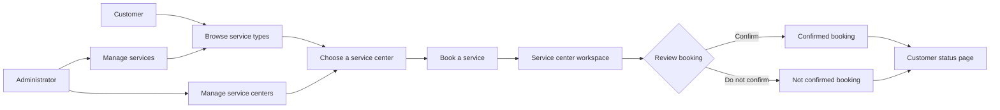
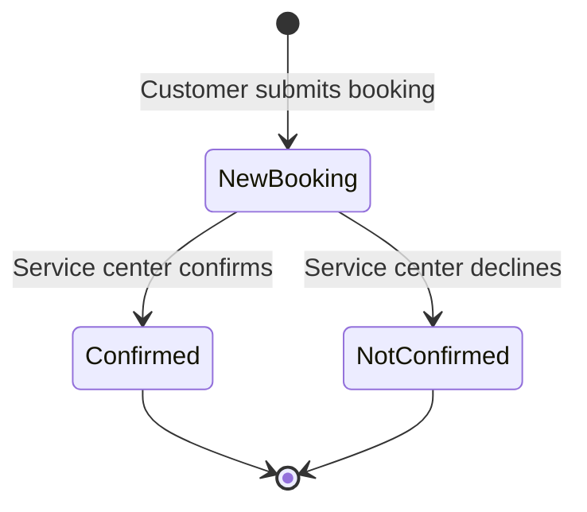

<div align="center">

# TORQUE FLOW

### Premium vehicle service booking and service center operations

<p><strong>PHP</strong> · <strong>MySQL</strong> · <strong>HTML</strong> · <strong>CSS</strong> · <strong>JavaScript</strong></p>

</div>

## Overview

Torque Flow is a full-stack vehicle service booking application. It brings customers, service centers, and administrators into one simple workflow: discover a service, make a booking, manage the request, and track its outcome.

The interface follows a dark, high-contrast automotive visual system with warm orange accents, technical typography, responsive layouts, and clear operational views for every role.

## Experience map



## Built for three roles

| Role | What they can do |
| --- | --- |
| Customer | Register, log in, browse services, choose a center, create a booking, and track booking status |
| Service center | Log in, review new bookings, confirm or decline requests, and view center-specific reports |
| Administrator | Log in, manage service types, upload service images, and manage the service center network |

## Core features

### Customer portal

Customers can explore available service types through image-led service cards, then use the booking screen to select a nearby service center, add a problem description, and choose a preferred date. The booking-status page keeps every customer informed about the current outcome.

### Service center workspace

Each service center sees only bookings assigned to its own center. New requests can be confirmed or not confirmed, and the reporting area separates all, confirmed, and not confirmed bookings.

### Administration panel

Administrators maintain the service catalogue and the service center network. Service records support names, descriptions, pricing, and image uploads. Center records store each location and its login details.

## Project structure

```text
Torque-Flow
│
├── Public pages
│   ├── index.php
│   ├── services.php
│   ├── about.php
│   ├── contact.php
│   ├── registration.php
│   └── login.php
│
├── Customer portal
│   ├── cust_view_service_type.php
│   ├── cust_book_service.php
│   └── cust_view_service_booking_status.php
│
├── Service center portal
│   ├── center_view_new_booking.php
│   ├── center_view_booking_report.php
│   ├── center_view_confirm_booking_report.php
│   └── center_view_notconfirm_booking_report.php
│
├── Administration
│   ├── admin_manage_type.php
│   └── admin_manage_service_center.php
│
├── Frontend assets
│   ├── css
│   ├── js
│   ├── images
│   └── type_img
│
└── connection.php
```

## Local setup

### Requirements

PHP with MySQLi enabled

MySQL or MariaDB

Apache or an all-in-one local environment such as WampServer

### Start the project

1. Start Apache and MySQL from WampServer or your preferred local stack.
2. Place this project inside the local web root. With WampServer, this is usually the `www` directory.
3. Create a database named `torque_flow`.
4. Import the project database structure and starter data.
5. Confirm the connection values in [connection.php](connection.php).
6. Open `http://localhost/torque-flow/` in your browser.

## Database expectations

The application uses the `torque_flow` database and expects the following tables.

| Table | Responsibility |
| --- | --- |
| `admin_detail` | Administrator accounts |
| `cust_regis` | Customer accounts |
| `service_center_info` | Service center details and credentials |
| `type_info` | Service types, descriptions, prices, and images |
| `service_booking_info` | Booking details, selected center, customer, and status |

## Booking lifecycle



| Status | Meaning |
| --- | --- |
| New Booking | Awaiting a response from the chosen service center |
| Confirmed | The service center accepted the booking |
| Not Confirmed | The service center declined the booking |

## Important session behavior

After a successful customer login, the application stores the customer ID in `custid`. This value is used when a booking is created.

After a successful service-center login, the application stores the center ID in `center_id`. This value filters bookings so each service center sees only requests assigned to its own location.

## Development notes

Service images uploaded through the administrator panel are saved in the `type_img` directory. The local server must have permission to write to this directory.

This project is designed for local development and learning. Before any public deployment, add password hashing, prepared SQL statements, CSRF protection, server-side authorization checks on protected routes, and environment-based database credentials.

## Troubleshooting

| Issue | Check |
| --- | --- |
| Database connection fails | Confirm MySQL is running, the `torque_flow` database exists, and [connection.php](connection.php) matches the local credentials |
| Customer booking has no customer ID | Log out and back in so the customer session is refreshed |
| Center cannot see its bookings | Log out and back in so the current `center_id` session is refreshed |
| Service image does not display | Confirm the image exists in `type_img` and the stored image path is correct |

<br>

<div align="center">

Built for smoother service experiences.

</div>
